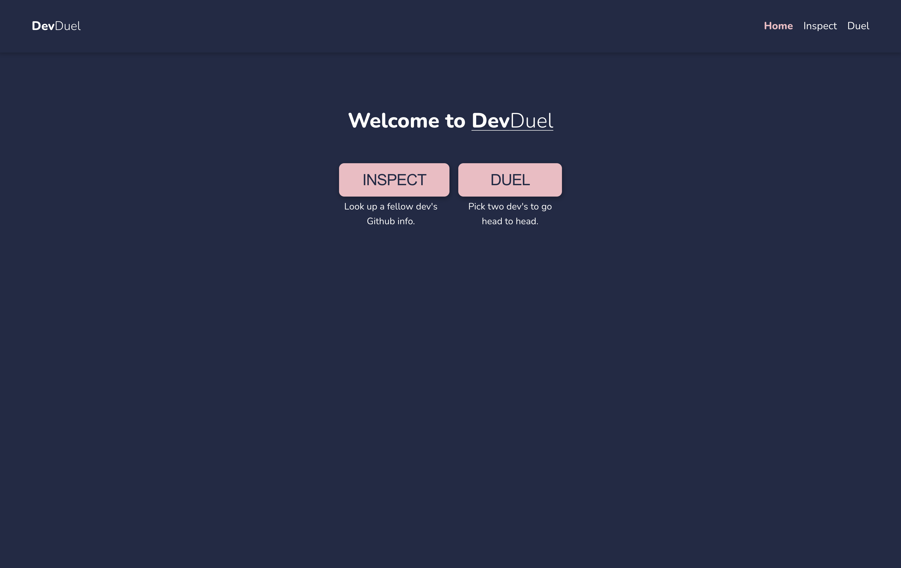
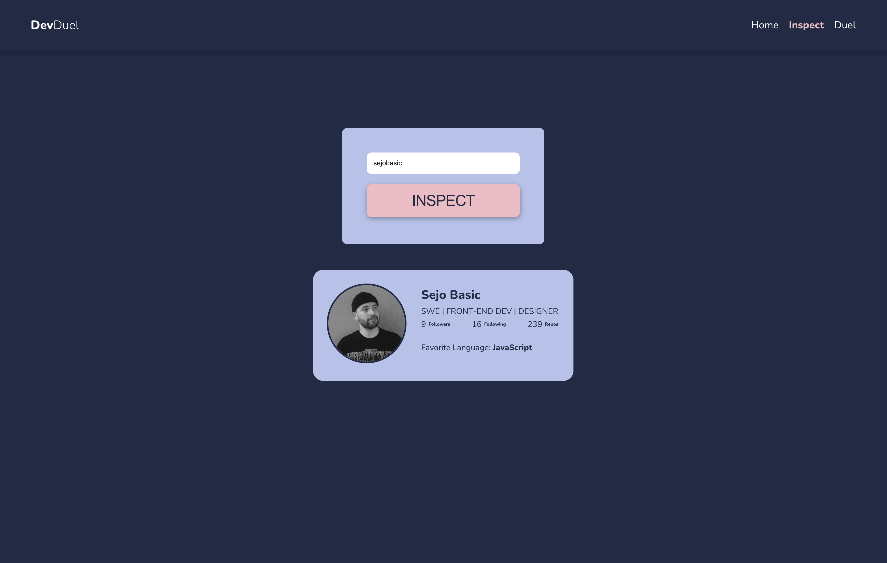
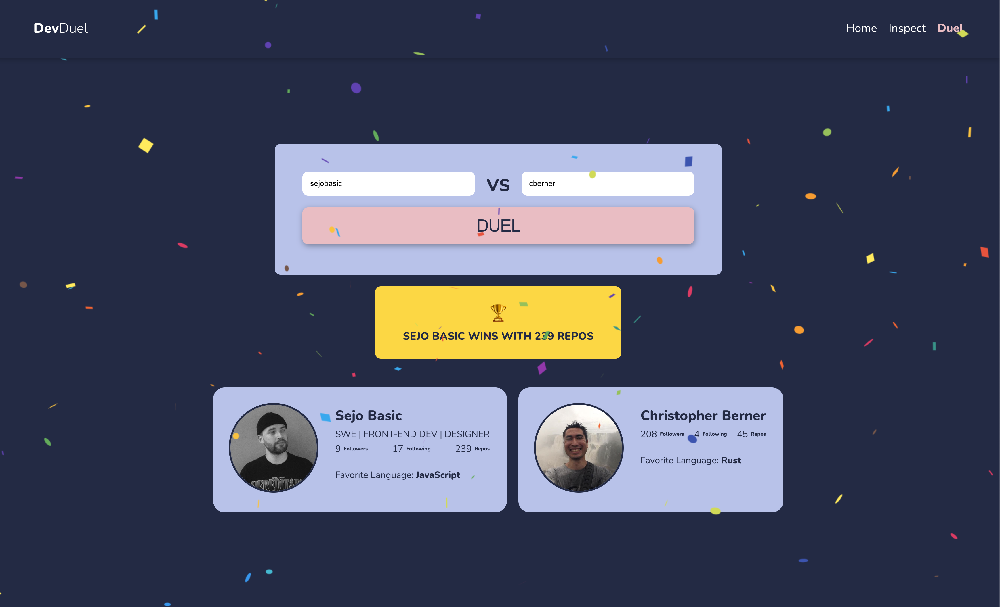

# React Dev Duel

### This project was a React assignment during my training at Cook Systems Fast Track Program.
For this assignment, I was tasked with developing a small full-stack application that interfaces with [GitHub's API](https://developer.github.com/v3/) in order to aggregate, transform, and display a given user's profile and repository data.  

The assignment is composed of two independent pieces that make up a simple full-stack application.
	
1. A [Node](https://nodejs.org/en/docs/) **server** exposing an API using [Express](https://expressjs.com/en/api.html)
2. A Web-based **client** using [HTML](https://developer.mozilla.org/en-US/docs/Learn/HTML), [CSS](https://developer.mozilla.org/en-US/docs/Web/CSS), [JavaScript](https://developer.mozilla.org/en-US/docs/Web/JavaScript), [ReactJS](https://reactjs.org/), and [Create React App](https://github.com/facebook/create-react-app)

### Inspect
On the **inspect** page, a client will enter a username, submit, and be displayed the user's `profile` data.

### Duel
For the **duel** page, two usernames will be entered, submitted, and their `profile` data displayed. Using the fields that are received from the API and displayed to the user, I used conditional rendering to visually signify differences in the data displayed as well as make an overall winner apparent to the user using modals and a [React Confetti Package](https://www.npmjs.com/package/react-confetti).

